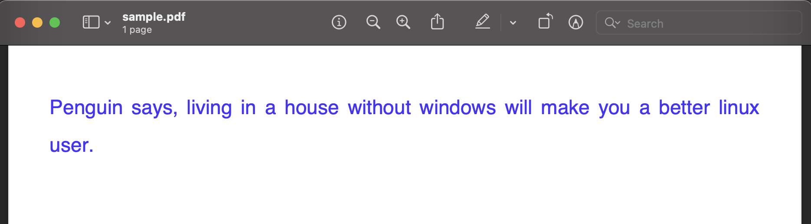

Twitter Thread to PDF
=====================


Create a PDF for Twitter Thread for archival purpose.


Installation
------------

* Install all the required third party libraries using ``requirements.txt``
* Generate an access token and access token secret through your app’s Keys and Tokens tab under the `Twitter Developer Portal Projects & Apps page <https://developer.twitter.com/en/portal/projects-and-apps>`_.
* Create a file ``.twitter_api`` in user's home directory like - 

```
[defaults]
CONSUMER_KEY = <TWITTER_CONSUMER_KEY>
CONSUMER_SECRET = <TWITTER_CONSUMER_SECRET>
ACCESS_TOKEN = <TWITTER_ACCESS_TOKEN>
ACCESS_TOKEN_SECRET = <TWITTER_ACCESS_TOKEN_SECRET>
```

* Copy Twitter Thread id you want to download, 


* Run,

```
# python main.py -t 1544158438900793344 -p sample.pdf
```

* You will get ``sample.pdf`` in current directory.




TODO
----

* Download images in Twitter thread
* bugfixing